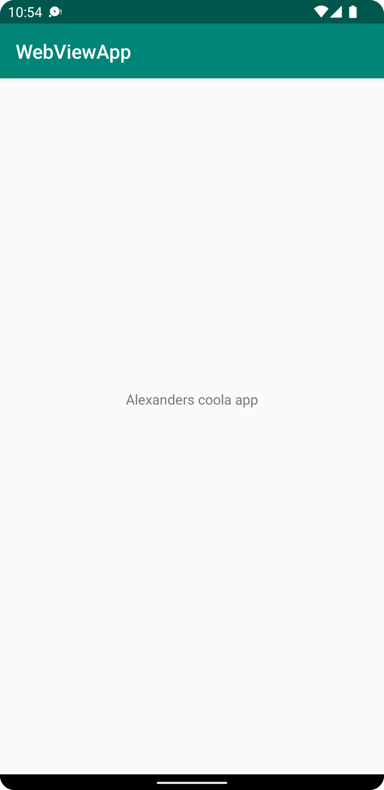

# Assignment 1: Hello World!

Tidigare text "Hello World" som fanns i content_main.xml har blivit ändrad till texten "Alexanders coola app".
Detta har ändrats i -TextView- taggen för elementet text som är en central text i appens vy. Nedan syns programkod
samt en bild som visar ändringen.

```
    <TextView
        android:layout_width="wrap_content"
        android:layout_height="wrap_content"
        android:text="Alexanders coola app"
        app:layout_constraintBottom_toBottomOf="parent"
        app:layout_constraintLeft_toLeftOf="parent"
        app:layout_constraintRight_toRightOf="parent"
        app:layout_constraintTop_toTopOf="parent" />
```

